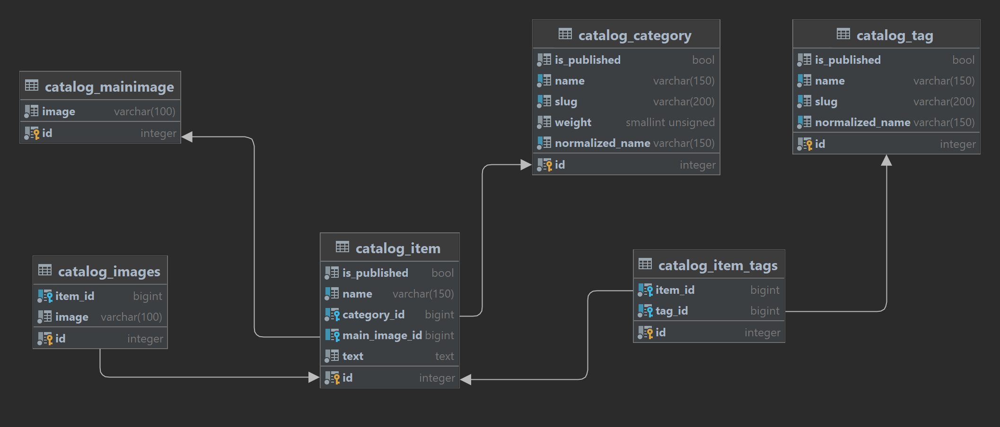

## Технологии
- Python 3.11
- Django 4.2

## Диаграмма Базы Данных


# Установка 
## Создание виртуального окружения
### Для Linux
```
python3 -m venv venv
source venv/bin/activate
```
### Для Windows
```
python -m venv venv
venv\bin\activate
```
## Установка .env
### Для Linux
```
mv template.env .env
```
И измените .env под себя
### Для Windows
```
ren template.env .env
```
И измените .env под себя

## Установка requirements
### Выберите один из файлов
Для работы сайта:
```
pip install -r requirements/prod.txt
```
Для разработки:
```
pip install -r requirements/dev.txt
```
Для тестирования и отладки:
```
pip install -r requirements/test.txt
```

# Запуск проекта
```
cd lyceum
python manage.py runserver
python manage.py migrate
python manage.py createsuperuser
python manage.py loaddata fixtures/data.json
python manage.py runserver
```

## Настройка собственного языкового пакета
### Добавьте в LANGUAGES в файле lyceum/lyceum/settings.py
```
("ru", django.utils.translation.gettext_lazy("Russian"))
```
Вместо "ru" код вашего языка и вместо "Russian" название вашего языка на английском
### Для создания файла языкового пакета
```
django-admin makemessages -l ru
```
Вместо ru используйте введеный ранее код вашего языка
### Для компиляции файлов языковых пакетов
```
django-admin compilemessages
```
